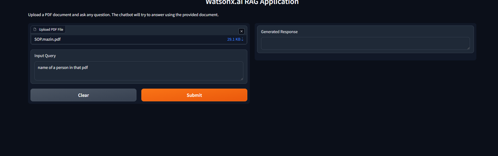

# 📄 Document QA Bot — Watsonx.ai RAG Application

A document-aware Question Answering bot built with **LangChain**, **IBM Watsonx.ai**, and **Gradio**. Upload any PDF and ask questions — the bot answers using only the content of your document, powered by a full RAG (Retrieval-Augmented Generation) pipeline.

> Built as the capstone project for the **IBM AI Engineering Professional Certificate** (Coursera, June 2026)

---

## 🚀 Demo

> _Adding a screenshot _
> 
> 

---

## 🧠 How It Works

```
PDF Upload → Document Loader → Text Splitter → Embeddings → Chroma Vector DB
                                                                      ↓
                                              User Query → Retriever → LLM (Granite) → Answer
```

1. **PDF is loaded** using `PyPDFLoader`
2. **Text is split** into overlapping chunks via `RecursiveCharacterTextSplitter`
3. **Chunks are embedded** using IBM Granite Embedding model and stored in **ChromaDB**
4. **User query** is matched against the vector store using semantic similarity
5. **Relevant chunks** are passed to the **IBM Granite LLM** to generate a precise answer

---

## 🛠️ Tech Stack

| Layer | Technology |
|---|---|
| LLM | IBM Granite (`ibm/granite-4-h-small`) via Watsonx.ai |
| Embeddings | IBM Granite Embedding (`ibm/granite-embedding-135m-en`) |
| RAG Framework | LangChain (`RetrievalQA`) |
| Vector Store | ChromaDB |
| Document Loader | PyPDFLoader |
| UI | Gradio |

---

## ⚙️ Setup & Installation

### 1. Clone the repository
```bash
git clone https://github.com/your-username/document-qa-bot.git
cd document-qa-bot
```

### 2. Install dependencies
```bash
pip install -r requirements.txt
```

### 3. Set up environment variables
```bash
cp .env.example .env
```
Edit `.env` and add your IBM Watsonx credentials:
```
WATSONX_URL=https://us-south.ml.cloud.ibm.com
WATSONX_PROJECT_ID=your_project_id
WATSONX_API_KEY=your_api_key
```

### 4. Run the app
```bash
python app.py
```
The Gradio interface will launch in your browser automatically.

---

## 📁 Project Structure

```
document-qa-bot/
│
├── app.py              # Main application — RAG pipeline + Gradio UI
├── config.py           # Centralized settings and model configuration
├── requirements.txt    # Python dependencies
├── .env.example        # Environment variable template
├── .gitignore          # Files excluded from version control
└── sample_docs/        # Sample PDFs for testing
```

---

## 📌 Key Features

- 🔍 **Semantic search** — finds the most relevant sections of your document, not just keyword matches
- 📚 **Any PDF supported** — research papers, manuals, textbooks, reports
- ⚡ **Fast retrieval** — ChromaDB enables millisecond-level vector similarity search
- 🔒 **Secure** — API keys managed via environment variables, never hardcoded

---

## 🎓 Certificate

This project was built as part of the **IBM AI Engineering Professional Certificate** on Coursera.

[](https://www.coursera.org/professional-certificates/ai-engineer)

---

## 👤 Author

**Muhammed Mazin K**  
B.Tech in Artificial Intelligence & Data Science — MES College of Engineering, Kerala  
[LinkedIn](https://www.linkedin.com/in/muhammed-mazin-416984361) • [GitHub](https://github.com/mazinofficial71) • [Email](mailto:mazinmachu71@gmail.com)
